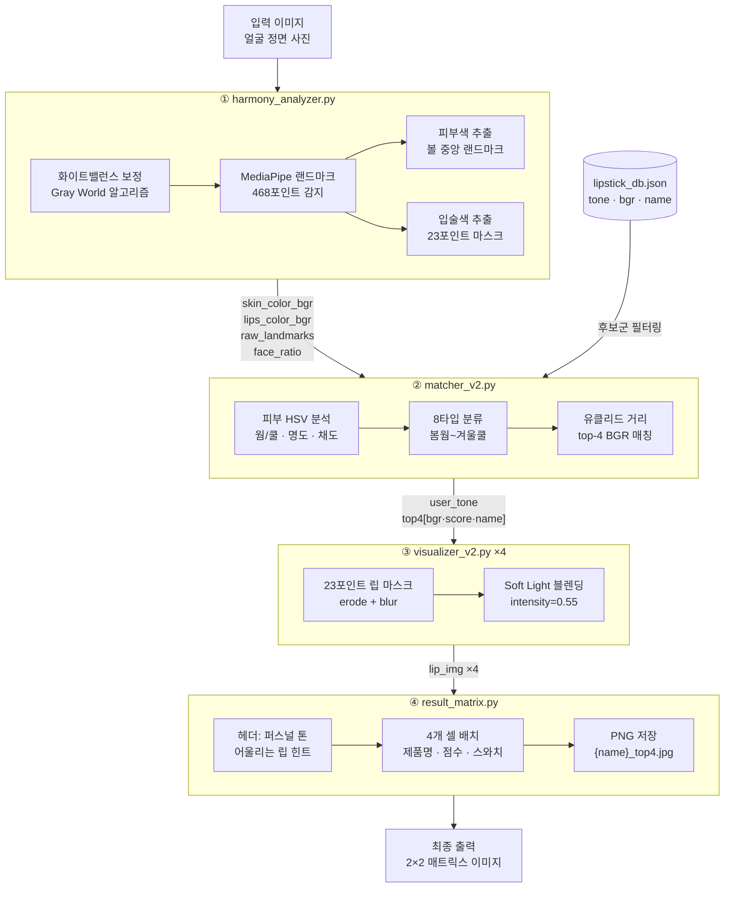
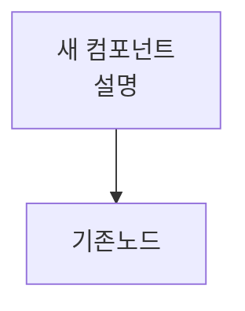

# CLAUDE.md

This file provides guidance to Claude Code (claude.ai/code) when working with code in this repository.

## Project Overview

**MLBB** is a Korean cosmetics AI application that analyzes facial features and personal color type to recommend lipsticks and generate virtual try-on images.

## Environment Setup

No `requirements.txt` — install dependencies manually:

```bash
pip install --upgrade matplotlib numpy scipy pandas
pip install opencv-python
pip install mediapipe==0.10.9
pip install scikit-learn
pip install requests python-dotenv
```

The `face_landmarker.task` (3.6 MB MediaPipe pre-trained model) must be in the project root for facial landmark detection to work.

## Quick Start: Running the Pipeline

**Web UI (Recommended):**
```bash
pip install streamlit
python -m streamlit run app.py
```
Opens interactive web interface at `localhost:8501`. Upload image → see 2×2 matrix of top-4 recommendations with virtual try-on.

**Batch processing (all images in `test_images/`):**
```bash
python run_pipeline_v3.py
```
Outputs `{filename}_top4.jpg` and `{filename}_result.json` in the same folder.

**Verify color analysis works (for development):**
```bash
python test_color_analyzer.py
```

## Building the Lipstick Database

The lipstick database (`lipstick_db.json`) powers product recommendations. Two active pipelines:

**From CSV (Recommended):**
```bash
python build_db_from_csv.py [--limit N]
```
Expects `lip_url.csv` with columns: `idx, brand, name, tone, url, link, category`. The `url` must be a product image URL.

**From Naver Shopping API (Requires .env):**
```bash
# Create .env with:
NAVER_CLIENT_ID=your_id
NAVER_CLIENT_SECRET=your_secret

# Then run:
python build_db_from_naver_v2.py [--items N]
```
Note: `build_db_from_naver.py` (old version) uses deprecated API patterns; use `v2`.

**Legacy (Deprecated):**
`db_manager.py` and `build_db.py` in `useless/` — do not use.

## Architecture

### User-Facing Analysis Pipeline

Four stages in `run_pipeline_v3.py`:

**1. Facial Landmark Detection** — `HarmonyAnalyzer` (`harmony_analyzer.py`)
- Loads `face_landmarker.task` via MediaPipe Task API
- Detects 468 facial landmarks
- Extracts skin tone from cheek region (landmarks 117/346) and lip color (outline) via `cv2.mean` on polygon masks
- Applies white-balance correction (Gray World algorithm)
- Returns: `raw_landmarks`, `skin_color_bgr`, `lips_color_bgr`, `face_ratio`

**2. Personal Color Diagnosis & Recommendation** — `LipstickMatcher_v2` (`matcher_v3.py`)
- Loads `lipstick_db.json`; falls back to default if missing
- Converts user's lip BGR → HSV: Hue 10–35 = Warm, else Cool; Saturation < 120 = Mute, else Bright
- Filters DB by tone match; falls back to full DB if no match
- Returns top-4 products with nearest BGR color (Euclidean distance)
- Match score: `100 * (1 - dist/441)` where 441 ≈ max BGR distance
- `face_ratio > 0.75` (wide face) → Gradation style, else Full-lip

**3. Virtual Try-On Rendering** — `LipVisualizer_v2` (`visualizer_v2.py`)
- Builds lip mask from 23 landmark outline points (`LIPS_OUTLINE_INDICES`)
- Erodes mask 2× and Gaussian-blurs to prevent color bleed
- Applies Soft Light blending at intensity 0.55 (preserves texture & luminosity)

**4. Result Matrix Composition** — `result_matrix.py`
- Arranges top-4 recommendations in 2×2 grid
- Includes personal color diagnosis header
- Outputs final composite image (PNG or JPG)

### Database Pipeline (`lipDB_pipeline/`)

Constructs `lipstick_db.json` with tone labels via code-based HSV analysis (no external AI required):

- `color_extractor.py` — Downloads product image URLs, extracts dominant BGR via K-Means (k=3)
- `color_analyzer_v2.py` — Analyzes HSV; determines tone category (Warm/Cool × Bright/Mute, or Autumn Mute)
- `db_store_v2.py` — Manages SQLite cache and JSON export
- `naver_scraper_v2.py` — Fetches products from Naver Shopping API with diverse search terms
- Called by `build_db_from_csv.py` and `build_db_from_naver_v2.py`

**Tone categories** (HSV-based diagnosis):
- `웜_뮤트` (Warm + Muted) — H: 10–35, S < 120
- `웜_브라이트` (Warm + Bright) — H: 10–35, S ≥ 120
- `쿨_뮤트` (Cool + Muted) — H: 75–120, S < 120
- `쿨_브라이트` (Cool + Bright) — H: 75–120, S ≥ 120
- `가을_뮤트` (Autumn Muted) — Warm + Muted + Very Dark (V < 80)

## Code Style & File Organization

Comments only for non-obvious logic; self-explanatory code needs no comments.

### Version Management

Files follow an iterative versioning pattern (`v1`, `v2`, `v3`, etc.). The highest version is active:
- `matcher_v3.py` — current active version (reads from `lipstick_db.json`, returns top-4)
- `visualizer_v2.py` — current active version (Soft Light blending)
- `run_pipeline_v3.py` — current active version (orchestrates full pipeline)
- `harmony_analyzer.py` — no versioning (stable, mature component)

**Deprecated code** is moved to `useless/` directory and should not be imported. Examples:
- `matcher1.py` (hardcoded 5-product DB)
- `run_pipeline.py` (single image, old output format)
- Legacy database builders (`db_manager.py`, old `color_analyzer.py`)

When adding features, follow the pattern:
1. Create `new_feature_v1.py`
2. Once mature, remove old version (or move to `useless/`)
3. Update imports in `run_pipeline_v3.py` and `app.py`

## Key Implementation Notes

- Comments and variable names often in Korean
- **File versioning**: Active versions are `v3` (e.g., `matcher_v3.py`, `run_pipeline_v3.py`); `useless/` contains deprecated code; legacy files with `v1`/`v2` may still exist
- Color space: BGR (OpenCV default); HSV used only for tone diagnosis
- Soft Light blending intentional (preserves texture) — don't replace with simple alpha overlay
- Skin tone extraction is MVP: doesn't mask eyes/mouth from cheek sampling
- `lipstick_db.json` may have `NaN` entries if CSV rows incomplete — these fall back to full-DB matching
- Web product images are oversaturated vs. real swatches; see `주저리.md` for planned alpha-correction approach
- **Claude API no longer required** — tone analysis is pure code-based HSV (as of INTEGRATION_COMPLETE.md)
- **EXIF handling**: Streamlit app uses PIL `ImageOps.exif_transpose()` to handle rotated images; pipeline functions accept numpy BGR arrays
- Python 3.11+ target runtime

---
## 아래 내용을 CLAUDE.md의 "Key Implementation Notes" 섹션 바로 아래에 붙여넣으세요.
---

## Deployment Environment

- **Platform**: Streamlit Cloud (https://streamlit.io/cloud)
- **Entry point**: `app.py`
- **Python version**: 3.11 (`.python-version` 파일 기준)
- **`face_landmarker.task`** (3.6MB): Git repo에 직접 커밋된 상태 — Streamlit Cloud에서 별도 다운로드 없이 사용됨
- **환경변수**: Streamlit Cloud의 Secrets 설정에서 관리 (`.env`는 로컬 전용)
- **`packages.txt`**: 시스템 패키지 의존성 (OpenCV 관련 리눅스 라이브러리 등)

> ⚠️ `face_landmarker.task`를 업데이트할 경우 반드시 repo에 커밋해야 배포 환경에 반영됨

---

## app.py — Streamlit UI 구조

`app.py`는 사용자 진입점. `run_pipeline_v3.py`와 별도로 자체 파이프라인 오케스트레이션을 포함함.

### UI 레이아웃

```
[ 네비바 ]
[ 좌측 (2) | 우측 (8) ]  ← st.columns([2, 8])
  좌측:
    - 이미지 업로드 (st.file_uploader)
    - 업로드 미리보기
    - "Discover My Colors" 버튼
    - 톤 맵 (8타입 팔레트, 진단된 톤 하이라이트)
  우측:
    - tone badge + "☁ Save" 다운로드 버튼
    - 2×2 립 이미지 그리드 (각 셀: 제품명, match score, 색상 바)
[ 하단: 제품 카드 4개 (구매 링크 포함) ]
[ 푸터 ]
```

### 핵심 함수

| 함수 | 역할 |
|------|------|
| `load_models()` | `@st.cache_resource` — HarmonyAnalyzer, LipstickMatcher_v2, LipVisualizer_v2 로드 (앱 재시작 전까지 캐시) |
| `run_pipeline(image_path, pil_img)` | 분석 전체 오케스트레이션. 결과를 `st.session_state["result"]`에 저장 |
| `apply_top4_individually(...)` | top4 립스틱 각각에 대해 렌더링 + 블렌딩 색 추출 |
| `tone_map_html(active_tone)` | 8타입 톤 팔레트 HTML 생성, 진단된 톤에 `active` 클래스 부여 |
| `make_grid_png(lip_images)` | Save 버튼용 2×2 그리드 PNG 바이트 생성 |
| `pil_to_b64(img)` | PIL Image → base64 JPEG (HTML `` 인라인 렌더링용) |
| `resize_letterbox(img, w, h)` | 이미지를 letterbox 방식으로 셀 크기에 맞춤 |

### 이미지 처리 흐름 (app.py 내부)

```
업로드된 파일
  → PIL.ImageOps.exif_transpose()  ← EXIF 회전 보정
  → tempfile로 저장 (HarmonyAnalyzer가 파일 경로를 요구)
  → run_pipeline() 호출
      → analyzer.analyze(image_path)
      → matcher.get_top4(analysis)
      → apply_top4_individually() → [PIL Image ×4], [hex색상 ×4]
  → os.unlink(tmp_path)  ← 임시파일 즉시 삭제
  → st.session_state["result"] = (lip_images, top4_result, blended_hexes)
```

### 스타일 구조

- 모든 CSS는 `app.py` 상단 `st.markdown(f"""<style>...</style>""")` 블록에 집중
- 외부 폰트: EB Garamond (serif), DM Sans (sans-serif), Material Symbols Outlined (아이콘)
- 색상 팔레트 기준색: `#645d5c` (메인 브라운), `#faf8f6` (배경), `#8b4c39` (포인트)
- Streamlit 기본 UI 요소 숨김: header, toolbar, decoration → `display: none`

---

## Known Issues & Fragile Areas

### 1. 조용한 에러 핸들링
`apply_top4_individually()`의 렌더링 실패 시 `except Exception: pass` 후 원본 이미지로 폴백.
유저 입장에서는 렌더링이 실패했는지 알 수 없음. 디버깅 시 이 함수를 먼저 확인할 것.

### 2. Python 버전 혼재 흔적
`__pycache__`에 `cpython-311`과 `cpython-314` pyc 파일이 공존.
가상환경이 바뀌었을 때 생긴 흔적. 실제 런타임은 3.11이며, `__pycache__` 전체 삭제 후 재실행해도 무방.

### 3. `visualizer_v1.py` 루트에 잔존
`useless/`로 이동 필요. 현재 아무것도 import하지 않지만 혼란 유발 가능.

### 4. `db_manager.py` 루트에 잔존
CLAUDE.md상 deprecated인데 루트에 남아있음. `useless/`로 이동 필요.

### 5. `lipstick_db.json` NaN 항목
CSV 빌드 시 불완전한 행이 있으면 NaN 발생. matcher가 전체 DB로 폴백하므로 앱은 돌아가지만
톤 매칭 정확도가 낮아질 수 있음. `check_db.py`로 확인 가능.

---

## Files to Clean Up

루트에 있지만 정리가 필요한 파일들:

| 파일 | 조치 |
|------|------|
| `visualizer_v1.py` | `useless/`로 이동 |
| `db_manager.py` | `useless/`로 이동 |
| `.claude/commands/audit.md` | npm 프로젝트용 템플릿 — Python 프로젝트에 불필요, 삭제 또는 교체 |

## Pipeline Architecture



### 다이어그램 수정 방법

**컴포넌트 추가**


**서브그래프 내부 노드 추가**
```
subgraph HA["① harmony_analyzer.py"]
    기존노드
    NEW2["새 처리 단계"] --> 기존노드
end
```

**화살표 위 레이블 수정**
```
A -->|"레이블 텍스트"| B
```

**노드 모양 종류**
```
[직사각형]   ("둥근 직사각형")   {마름모}   [("DB 실린더")]
```